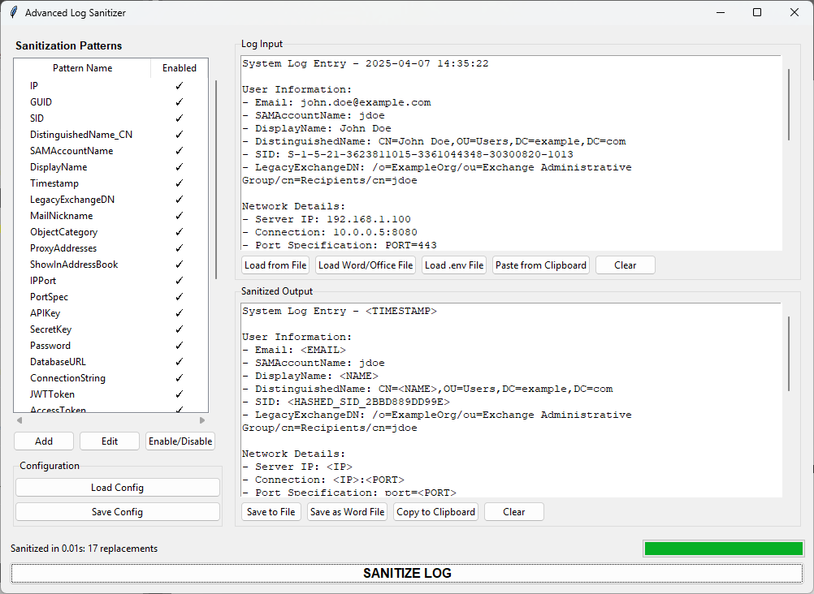

# Advanced Log Sanitizer

## Advanced Log Sanitizer Screenshot
Screenshot of the Advanced Log Sanitizer GUI in action.  


## Overview
Advanced Log Sanitizer is a powerful, open-source GUI application designed to safeguard sensitive information in log files, documents, and text inputs. By leveraging customizable regex-based sanitization patterns, it automatically replaces or hashes sensitive data such as emails, IP addresses, credentials, and more—ensuring data privacy and compliance with regulations like GDPR and HIPAA. With support for multiple file formats and an intuitive interface, it’s ideal for developers, IT professionals, and organizations handling sensitive logs.

## Key Features

### Robust Data Protection
- **Sanitizes sensitive data** across text, `.env`, Word, Excel, and PowerPoint files.
- Built-in patterns for common sensitive data (e.g., emails, IPs, GUIDs, API keys).
- **Optional hashing** for sensitive fields (e.g., passwords, tokens) using secure SHA-256 with random salts.
- **Customizable regex patterns** for tailored sanitization needs.

### Flexible Input and Output
- **Load files** via drag-and-drop, file dialog, or clipboard paste.
- **Save sanitized output** as text or Word documents.
- **Copy sanitized text** to the clipboard for quick sharing.
- **Export/Import sanitization configurations** as JSON for easy reuse.

### Advanced Pattern Management
- **Add, edit, enable, or disable sanitization patterns** through the GUI.
- Support for **case-sensitive** and **case-insensitive** regex matching.
- **Prioritized pattern application** for accurate replacements.
- Visual pattern status indicators (✓/✗) for quick management.

### Performance and Usability
- **Background processing** for large files to maintain a responsive UI.
- **Progress bar and status updates** during sanitization.
- **Detailed logging** with rotation (5MB, 3 backups) for troubleshooting.
- **Undo/redo support** in the input text area.

## System Requirements

### Minimum Requirements
- **OS:** Windows, macOS, or Linux
- **Python:** 3.7 or higher
- **Tkinter:** Usually included with Python (install via `python3-tk` on Linux if needed)

### Optional Libraries (Recommended)
- **python-docx:** For Word document support (`pip install python-docx`)
- **pandas** and **openpyxl:** For Excel file processing (`pip install pandas openpyxl`)
- **python-pptx:** For PowerPoint file support (`pip install python-pptx`)

## Installation

### Clone the Repository
```bash
git clone https://github.com/MoshikoKar/LogSanitizer.git
cd LogSanitizer
```

### Install Dependencies
```bash
# Install optional libraries for full functionality
pip install python-docx pandas openpyxl python-pptx
```

### Run the Application
```bash
python log_sanitizer.py
```

## Quick Start Guide

### Loading Content
- **Load a File:** Click "Load from File" for text/logs or "Load .env File" for configuration files. Use "Load Word/Office File" for `.docx`, `.xlsx`, or `.pptx` files.
- **Paste Text:** Click "Paste from Clipboard" or press `Ctrl+V` to input text directly.
- **Review Input:** Verify the content in the "Log Input" text area.

### Sanitizing Content
- **Check Patterns:** In the left panel, review enabled patterns (marked with ✓). Double-click to toggle or use "Add/Edit" for custom patterns.
- **Sanitize:** Click the "SANITIZE LOG" button to process the input.
- **View Results:** The sanitized text appears in the "Sanitized Output" area. A dialog will summarize replacements (e.g., "Email: 2, IP: 1").

### Saving Output
- **Save to File:** Click "Save to File" for a `.txt` file or "Save as Word File" for a `.docx` file.
- **Copy to Clipboard:** Click "Copy to Clipboard" to copy the sanitized text.

### Example Input
Try pasting this sample text to see sanitization in action:
```
User: jdoe, Email: john.doe@example.com, IP: 192.168.1.100:8080  
API_KEY=sk_live_12345abcde, PASSWORD=admin123!  
Logged at 2025-04-07 14:35:22
```

**Expected output:**
```
User: <USERNAME>, Email: <EMAIL>, IP: <IP>:<PORT>  
api_key=<HASHED_APIKEY_...>, password=<HASHED_PASSWORD_...>  
Logged at <TIMESTAMP>
```

## Configuration

### Built-in Patterns
The application includes patterns for:
- **Personal Data:** Emails, usernames, hostnames, SIDs, GUIDs
- **Network Data:** IP addresses, ports (e.g., 192.168.1.1:8080), port specifications (e.g., PORT=443)
- **Credentials:** API keys, secret keys, passwords, JWT tokens, database URLs
- **System Data:** File paths, timestamps, Active Directory attributes

### Custom Patterns
- Click "Add" in the pattern panel to create a new regex pattern.
- Specify the pattern name, regex, replacement text, and options (case-sensitive, hash values).
- Save configurations to a `.json` file via "Save Config" or load existing ones with "Load Config".

#### Example Custom Pattern
To sanitize phone numbers like `(123) 456-7890`:
- **Name:** PhoneNumber
- **Regex:** `\(?\d{3}\)?[-.\s]?\d{3}[-.\s]?\d{4}`
- **Replacement:** `<PHONE>`
- **Case Sensitive:** No
- **Hash Values:** Optional

## Logging and Monitoring
- **Log Location:** `logs/sanitizer.log`
- **Features:** Tracks sanitization details, errors, and file operations.
- **Rotation:** Logs rotate at 5MB, keeping up to 3 backups.

## Limitations
- **Large Files:** Very large files (>100MB) may slow down processing. Consider splitting files for better performance.
- **Office Files:** Requires optional libraries for full support. Without them, only text files and `.env` files are fully supported.
- **Preview:** No real-time preview of pattern matches before sanitization.
- **Regex Complexity:** Invalid regex patterns may cause errors; test patterns carefully.

## Security Considerations
- **Sequential Processing:** Patterns are applied in order of specificity (longer regex first). Review pattern order for overlapping matches.
- **Hashing:** Sensitive data (e.g., passwords, tokens) can be hashed with SHA-256 and a random salt for irreversible sanitization.
- **Data Handling:** The application processes data in memory and does not store input/output unless explicitly saved by the user.
- **Configuration Safety:** Avoid sharing `.json` config files containing sensitive regex patterns.

## Contributing
We welcome contributions! To contribute:
1. Fork the repository at [https://github.com/MoshikoKar/LogSanitizer](https://github.com/MoshikoKar/LogSanitizer).
2. Create a feature branch:  
   ```bash
   git checkout -b feature/my-feature
   ```
3. Commit changes:  
   ```bash
   git commit -m "Add my feature"
   ```
4. Push to the branch:  
   ```bash
   git push origin feature/my-feature
   ```
5. Open a pull request with a detailed description.

Please follow the [Contributor Covenant Code of Conduct](https://www.contributor-covenant.org/version/2/0/code_of_conduct/).

## Troubleshooting
- **Missing Libraries:** If Office file support fails, ensure `python-docx`, `pandas`, `openpyxl`, and `python-pptx` are installed.
- **Invalid Regex:** Check the log file for regex compilation errors and validate patterns using tools like [regex101.com](https://regex101.com).
- **UI Issues:** Ensure Tkinter is installed (e.g., `sudo apt-get install python3-tk` on Ubuntu/Debian).
- **Contact:** Open an issue at [https://github.com/MoshikoKar/LogSanitizer/issues](https://github.com/MoshikoKar/LogSanitizer/issues).

## License
This project is licensed under the MIT License. See the [LICENSE](LICENSE) file for details.

## Support
For bugs, feature requests, or questions:
- Open an issue: [https://github.com/MoshikoKar/LogSanitizer/issues](https://github.com/MoshikoKar/LogSanitizer/issues)
- Check the Wiki for additional documentation (coming soon).

Star the repository on GitHub if you find it useful!